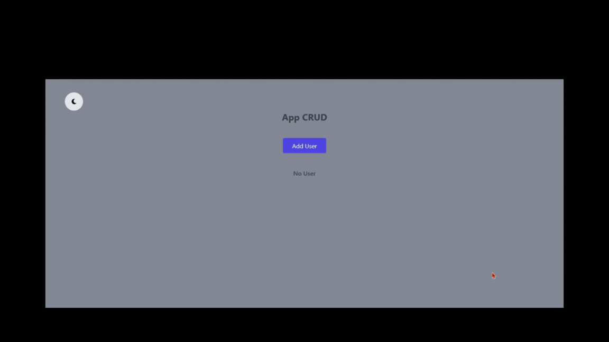

# Preview
[Link DEMO](https://crud-redux-e0nf17gcm-navarroaariel-hotmailcom.vercel.app)

## Getting Started with Create React App

This project was bootstrapped with [Create React App](https://github.com/facebook/create-react-app).

## Available Scripts

In the project directory, you can run:

### `npm clone "repository"`

Use the command git clone "your repository"

### `npm install`

Install your dependencies.

### `npm start`

Runs the app in the development mode.\
Open [http://localhost:3000](http://localhost:3000) to view it in your browser.

The page will reload when you make changes.\
You may also see any lint errors in the console.

## Technologies and Libraries

### `npm Install react-redux`

### `npm react-router-dom`

### `npm install uuidv4`

### `FontAwesome`

## Learn More

You can learn more in the [Create React App documentation](https://facebook.github.io/create-react-app/docs/getting-started).

To learn React, check out the [React documentation](https://reactjs.org/).

